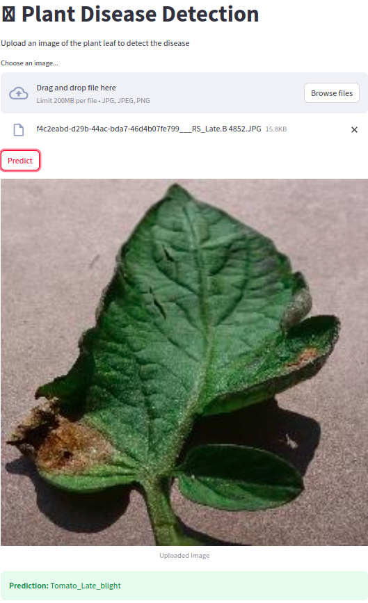

# Plant-Disease-Diagnosis-Flask
Online Streamlit  App for Plant Disease Diagnosis from Images <br>

<br><br>

## Required Tools
```
Python 3.9 or greater, Tensorflow 2, streamlit, Scikit-Learn
```

## Requirements
```
pip install -r Requirements.txt
```

## Run
```
streamlit run main_app.py
```


## Dataset

https://www.kaggle.com/emmarex/plantdisease


## Implementation

https://www.kaggle.com/code/abdelmoneimrehab/plant-disease-detection-using-keras/notebook?scriptVersionId=178116466


